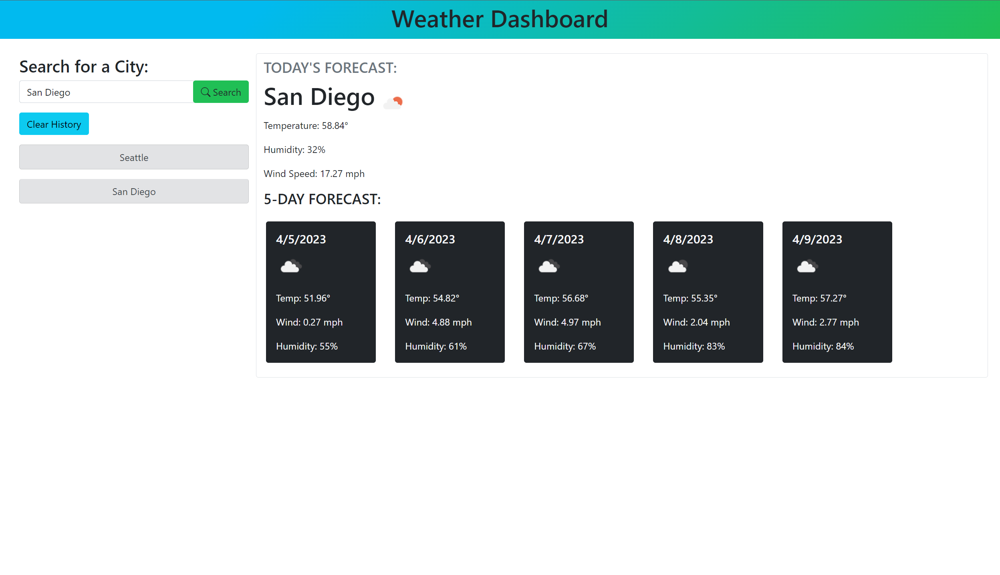

# Weather Dashboard 

## Description

A weather dashboard application that allows users to search for current and future weather information by city.

This application uses the OpenWeather One Call API to retreive weather data and local storage to save persistent data with dynamically updated HTML and CSS.

## Technologies Used

- jQuery
- Moment.js
- Bootstrap
- Server-Side API [OpenWeather](https://openweathermap.org/)

## Screenshot

The following image shows the web application's appearance and functionality:

## Site Link

[Weather Dashboard](https://chloeharris1.github.io/weatherdashboard/)

## License

Licensed under the MIT license.

## Credits

Weather favicon from [iconixar](https://www.flaticon.com/authors/iconixar)

## Questions

[Email Me](Chloe.a.harris17@gmail.com) if you have any questions.

Check out more of my work on [GitHub](https://github.com/chloeharris1).
